# Collaborating with Git

Git is a distributed version control system, which implies there is no central repository. All collaborators have a local repository upon which they work and share their project. **Local** is the repository on your local system. **Remote** are all the repositories which are on other computers. The default name for a remote is **origin**.

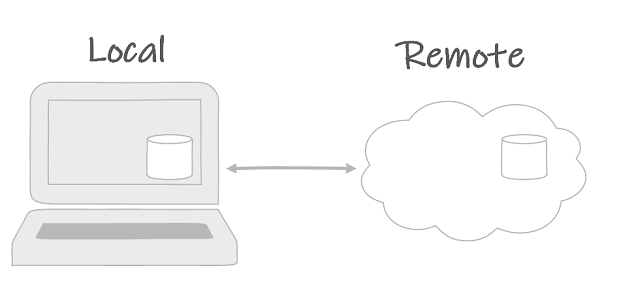

In order to facilitate sharing repositories cloud-based services have been developed such as BitBucket, GitLab and GitHub.

## GitHub

[GitHub](https://github.com/) is a web-based hosting service for code. It is built upon Git and provides project management features, such as bug tracking, feature requests, task management, etc. GitHub is the largest host of source code in the world and hosts the largest open source community. It provides both public open source and private repositories.

### Sign up

Register your free account at [GitHub](https://github.com/).

### SSH keys

GitHub uses SSH with RSA public key encryption to authenticate users with git.

1. First, you have to generate a **public/private keypair**.

    ```bash
    ssh-keygen -t rsa -b 4096 -C "your_email@example.com"
    ```

    ::: output
    Generating public/private rsa key pair.

    Enter a file in which to save the key (/c/Users/you/.ssh/id_rsa):[Press enter]
    :::

    Press enter to confirm the default location.

    ::: output
    Enter passphrase (empty for no passphrase): [Press enter]

    Enter same passphrase again: [Press enter]
    :::

    Press enter twice to generate a keypair without a passphrase.

    Next, locate the public key `id_rsa.pub` and open it with Visual Studio Code.

    ::: warning
    Do not open `id_rsa.pub` with Publisher.
    :::

2. Copy the contents of `id_rsa.pub`.
3. Then, on GitHub.com click in the upper-right corner on your profile photo, next click **Settings**.

    

4. In the user settings sidebar, click **SSH and GPG keys**.

    

5. Click New SSH key.

    

6. In the *title* field, add a descriptive label, for instance your computer name.
7. Paste your key into the *key* field
8. Click **Add SSH key**

### GitHub repository overview

GitHub provides visuals of the Git repository

* View commits history with contributor, diff and hash
* View remote branches
* View releases (git tags)

Furthermore it offers project management features, not limited to:

* Team members management
* Issue management
* Wiki
* Actions

### Create a new repository

Create a new repository on [GitHub.com](https://github.com) by clicking new. It's a good practice to create a new repository for each project.

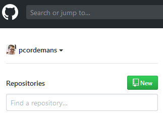

Choose:

* A repository name
* To make it public or private

Repository initialization depends on whether you start from GitHub or from a local Git repository.

* Starting from a local repository
    1. Do not check "initialize this repository with a README"
    2. In your local git repository
        ```bash
        git remote add origin git@github.com:yourusername/repositoryname.git
        git push origin master
        ```
* Starting from GitHub
    1. Check "initialize this repository with a `README.md`"
    2. Optionally choose a preconfigured gitignore file
    3. Optionally choose an open source license
    4. Clone the repository to desktop

### Cloning repositories

Downloading a repository from a remote with git is called **cloning**.

In order to clone a repository from GitHub navigate to the project page and click **clone or download**.

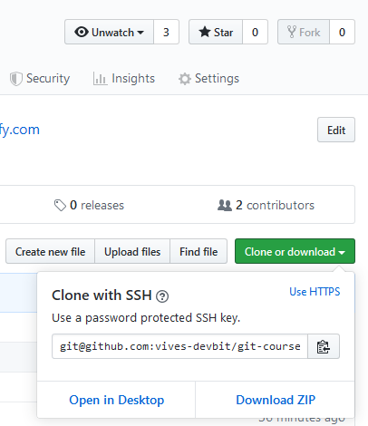

Then copy the URL, for example `git@github.com:vives-devbit/git-course.git`

Finally, clone the repository:

```bash
git clone <url>
```

### Viewing the remote of a repository

To check the remote URL of a repository, use git remote:

```bash
git remote -v
```

The `-v` parameter of the remote command shows the remote name and URL. For example:

::: output
origin  git@github.com:vives-devbit/git-course.git (fetch)

origin  git@github.com:vives-devbit/git-course.git (push)
:::

### Pushing a branch to a remote

Uploading commits from your local repository to a remote repository is called a **push**. Typically whole branches are pushed.

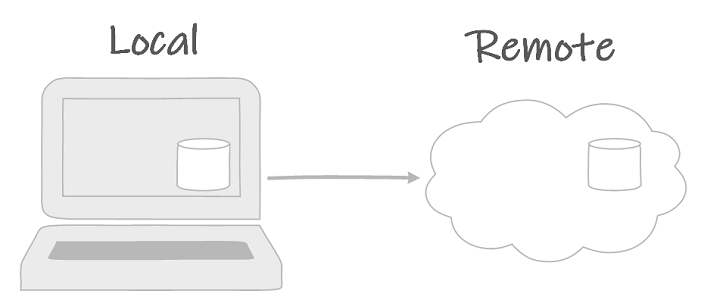

For example to push the master branch to origin:

```bash
git push origin master
```

::: tip
The master branch is the default branch of a git repository.
:::

::: warning
It is not possible to push a branch to a remote if you did not retrieve the latest commits from the remote. Do a git pull before you push.
:::

### Pulling a branch from a remote

Retrieving the latest commits from a remote is called a **pull**. Typically whole branches are pulled.

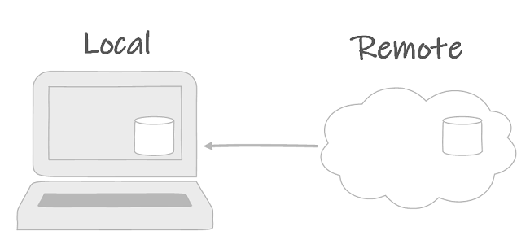

For example to pull the master branch from origin:

```bash
git pull origin master
```

There are three possible outcomes after pulling a branch from a remote.

1. The local and remote branch are identical. Nothing happens.
2. The local and remote branch differ, but git automagically merges all differences without human intervention. Your local repository contains the merged branch, the remote repository did not change.
3. The local and remote branch differ and git detects a merge conflict. Human action is required to resolve the **merge conflict**.

## Merge conflicts

> Rather sooner than later you will change something somebody else has also changed.

Merge conflicts arise when changes between two commits affect the same lines in one or more files. Git inserts *conflict dividers* to indicate where the merge conflict happened and what contents both commits propose at the conflict.

For example:

::: output
    <<<<<<< HEAD
    Some text in conflict in a commit
    ========
    other text in conflict in the other commit
    >>>>>>> someBranch
:::

It is possible to manually remove the conflict dividers and select the new contents. Make a new commit indicating that the merge conflict has been resolved.

Visual Studio Code offers some tools to help. In a file with a merge conflict, clicking one of the possible actions resolves the conflict. Afterwards commit the changes resolving the conflict to the repository.

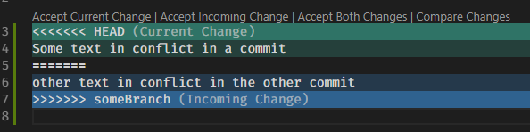

## Branches

Arguably, the most powerful feature of git is to branch locally, in a true distributed fashion. Branching is creating an alternative set of commits, concurrently from other branches. In essence, if commits are nodes in a graph, then branching allows the creation of alternative paths in the graph.


Branching is creating an alternative set of commits, which exists concurrently from other branches. Merging is combining two branches in a new merge commit.

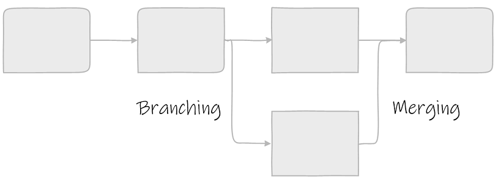

More accurately, a branch is a pointer to a commit. For instance, the `master` branch is the default branch in a git repository, which usually points to the latest commit of a stable revision of the project.

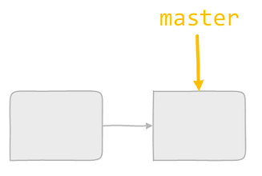

The **HEAD** pointer points to the commit of the working copy. In this example, `HEAD` points to the same commit as the master branch.

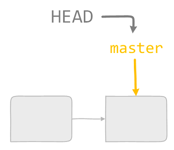

Use the `git checkout` command to jump back to an old commit.

```bash
git checkout <hash of the commit>
```

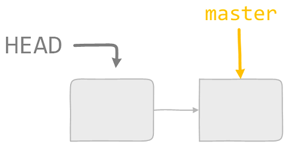

:::warning
Checking out a commit without creating a branch, leaves the working copy in a detached HEAD state. This state is sort of a read only state, where you can look at the files at the state of the given commit, but does not allow you to make new commits. Create a new branch if you want to make a commit.
:::

### Create a new branch

In most of the cases you want to create a new branch, i.e. a new pointer in the graph and checkout that branch. Use the `checkout` command with the `-b` parameter and give a name to the new branch.

```bash
git checkout -b dev
```

For example this command will create a `dev` branch and jump to the `dev` branch. The `dev` branch effectively points to the same commit as the master branch.

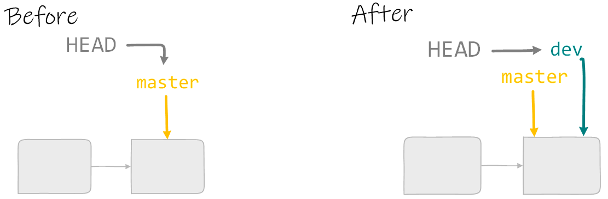

Then start committing at the new branch:

```bash
git commit -m"this message explains everything"
```

This will move forward the dev branch and the `HEAD` pointer. The master branch remains unchanged.

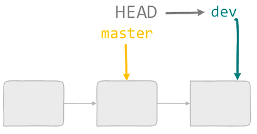

### Fast forwarding

When two branches differ, but their history is common, one branch is lagging behind the other. Merging these two branches will perform a fast forward. This will result in both branches pointing at the same commit.

::: tip
Before merging, always checkout the branch you want to merge to.
:::

```bash
git checkout master
git merge dev
```

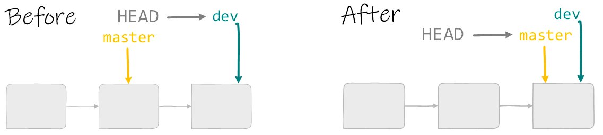

### Branching and merging

In this scenario a dev branch is one commit ahead of master. First, checkout master. Then add a commit to the master branch. Now dev and master are two siblings in the commit tree.

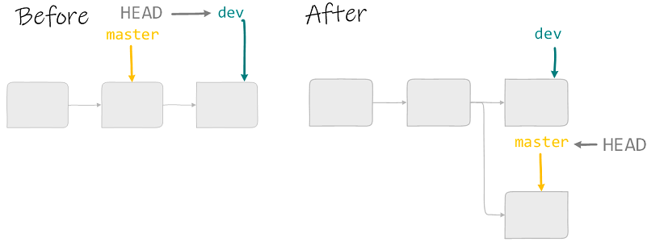

```bash
git checkout master
git commit -m"descriptive message"
```

Merging two branches can be easily done with merge. First, checkout the branch which you want to merge to. Then git merge the branch you want to merge with. Resolve any merge conflicts if needed.

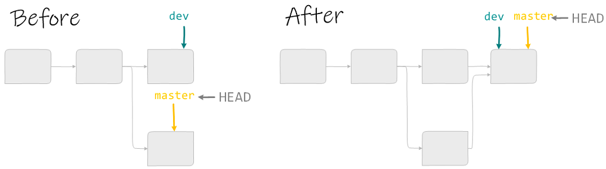

This example continues from the previous scenario. The master branch is the branch we want to merge dev into. HEAD is already pointing to master, so a checkout of master is not needed. Executing the merge command merges dev into master.

```bash
git merge dev
```

## Forking and pull requests

GitHub provides user authorization for each GitHub repository. Only team members can commit to the repository. However, by means of a pull request GitHub provides the possibility for someone who isn't a team member to contribute. Pull requests are an important means to share code and contribute to open source projects. The workflow for a pull request is:

1. In GitHub: fork the repository. CLick the fork button in the upper right corner. This creates a clone of the repository in your account. In this repository you can do what you want, as it is your own repository.

    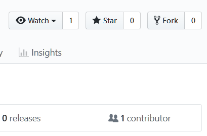
2. Clone the forked repository to your local machine.
    ```bash
    git clone git@github.com/username/repository.git
    ```
3. Create a feature branch
    ```bash
    git checkout -b feature/fooBar
    ```
4. Commit your changes
    ```bash
    git add .
    git commit -m "Add some fooBar"
    ```
5. Push the branch to your GitHub repository
    ```bash
    git push origin feature/fooBar
    ```
6. Create a new Pull Request in the original repository on GitHub. Click Compare & pull request
    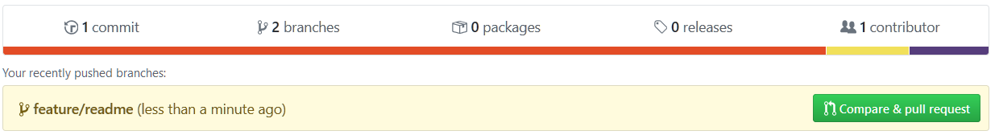

::: tip
Many projects have their own procedure how to contribute. This procedure is usually found in the project documentation. When this procedure is not provided, it might be a good idea to open an issue to explain the purpose of your pull request.
:::

## GitHub Education

GitHub has an [education program](https://education.github.com/). Part of this education program is [GitHub Classroom](https://classroom.github.com/). With GitHub Classroom it is possible to manage classroom assignments. An assignment starts from a repository the teacher provides. Each student clones this repository and adds a solution. All solutions are easily aggregated with Classroom Assistant.

## In depth Git

* [Pro Git by Scott Chacon and Ben Straub](https://git-scm.com/book/en/v2)
* [Atlassian Git tutorial](https://www.atlassian.com/git/tutorials)
