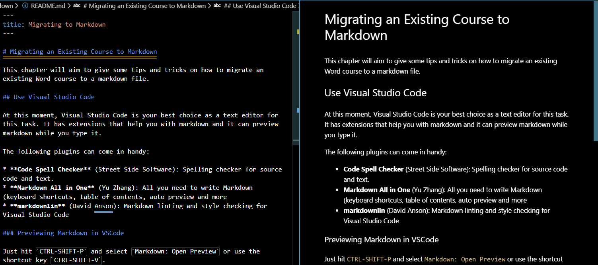
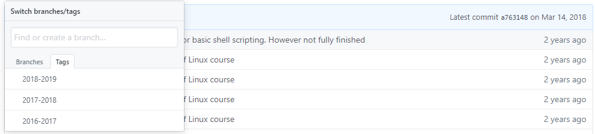

# Migrating an Existing Course to Markdown

This chapter will aim to give some tips and tricks on how to migrate an existing Word course to a Markdown file.

## Use Visual Studio Code

At this moment, Visual Studio Code is your best choice as a text editor for this task. It has extensions that help you with Markdown and it can preview Markdown while you type it.

The following plugins can come in handy:

* **Code Spell Checker** (Street Side Software): Spelling checker for source code and text.
* **markdownlin** (David Anson): Markdown linting and style checking for Visual Studio Code

### Previewing Markdown in VSCode

Just hit `CTRL-SHIFT-P` and select `Markdown: Open Preview` or use the shortcut key `CTRL-SHIFT-V`.



:::warning GitHub and VuePress flavored markdown
Do note that some GitHub or VuePress flavored markdown may not be previewed correctly. Just ignore those and check them on the local site (running with the development server). Typical examples are containers like these.
:::

## Local Development Server

While the Markdown preview is perfect for single page alterations, its always a good idea to keep your local development server running in the background and checking the website periodically in a browser.

Launch the local development server using the following command:

```shell
npm run docs:dev
```

## Use a development branch

Best is to use a `development` of `dev` branch to work on in git. This will make sure you always have a working version in master.

Finished a chapter and tested it thoroughly on your computer ? Then merge it into `master` and push it to GitHub, automatically triggering a build.

Also make sure to push your development branch to GitHub. That way, you will always have your latest commits stored in the cloud. Unless explicitly linked to Netlify, a push toward other branches than `master` will not trigger a build. So don't worry to break something or waste build-minutes.

Creating and pushing a `dev` branch:

```bash
git checkout master
git checkout -b dev
git push origin dev
```

Merging tested changes from `dev` into `master` can be achieved as follows:

```bash
git checkout master
git merge dev
```

:::warning Clean State
Always make sure to be in a clean state when merging changes or pulling changes. Clean state means no changed files. When executing `git status` it would return `nothing to commit, working tree clean`.
:::

Once tested thoroughly, you can push it using `git push origin master`.

## Think Content not Style

Migrate small sections at a time when moving content from Word to Markdown. Not a good idea to copy whole pages.

Sometimes it is best to work paragraph per paragraph. Try not to focus on styling and layout but rather on the content itself. Let Markdown and VuePress do the hard word for you.

## Referencing Images

While very important in scientific documents, VuePress and Markdown do not allow one to directly reference images by for example their caption number.

Try to avoid sentences such as `in the figure below ...` because there is also no option to style how images are include in pages when printing to a PDF or printer. The image may as well land on the next page. It is better practice to reference images and tables using sentences such as `in the next table ...`.

## Adding Images

When adding images to your chapters, follow these guidelines to make sure they can displayed by VuePress:

* Place the images in the `assets` folder of the correct chapter.
* Use a relative path starting with `./assets` to include your image in Markdown.
* **Don't use spaces** in the name of images. Use dashes `-` and underscores `_` instead.
* Try to give all your images **lower-case names**.

## Adding Formulas

For the moment we have not yet thoroughly tested this feature but there seems to be a plugin available for adding LaTex formules called [vuepress-plugin-mathjax](https://vuepress.github.io/en/plugins/mathjax/).

Other options include online LaTex image generators such as [codecogs](https://www.codecogs.com/latex/eqneditor.php).

We will look into other options in the near future.

### Sizing Images

There is no way to size your images. They are automatically sized based on their resolution and the available place on the VuePress page. This allows the images to be decently rendered on mobile devices too.

If your image is too large, consider providing them in a smaller resolution or by adding making the canvas bigger with a transparent background.

## Fixing Problems

In the beginning you may hit some problems when not yet used to the Markdown and VuePress life. It may occur that your local development website shows an empty page because it could not convert the Markdown to html.

This is often due to a missing image or incorrect path. The quickest way to find these errors is to use the VSCode preview. It will show missing images using an broken image.


If that does not give you a clue, you can always activate a local build process using the command

```bash
npm run docs:build
```

Which will output errors as encountered to the terminal:


## Use Tags for versions

Want to refactor part of your course at the end of the semester? Then it is also a good idea to tag the current state of your course. This way you will easily find your way back if ever needed.



Creating tags and pushing them can be achieved using the following git commands:

```bash
git tag 2019-2020
git push origin --tags
```

The label or name of the tag can be chosen as you wish.

## Copyright

Copyright law is quite restrictive. Bluntly speaking, if you have no explicit permission you may not use the material. Most educational books contain a description what is understood as educational purposes or describes the procedure to ask for permission from the author. However, a lot of material is shared under open and free culture licenses. 

* The [Creative Commons](https://creativecommons.org/) is a very popular license for media and text. For example: Wikipedia uses it. It is possible to select a number of features, such as do you allow adaptations or commercial use of your work? Attribution is needed in order to make use of the material.
* The [MIT](https://opensource.org/licenses/MIT) license]is a very brief open source software license. It does not include any limitations, only denying liability.
* The [GPLv3](https://opensource.org/licenses/gpl-license) license is a viral license, a.k.a. a copyleft. Any adaptations of software under the GPL license must be released with a GPL license.
* The [Apache-2.0](https://opensource.org/licenses/Apache-2.0) license requires a NOTICE text file in which is described which adaptations have been made by whom.