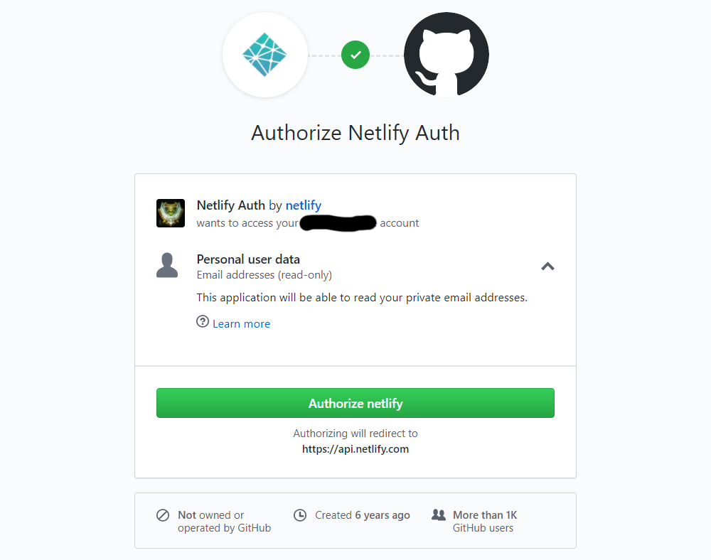
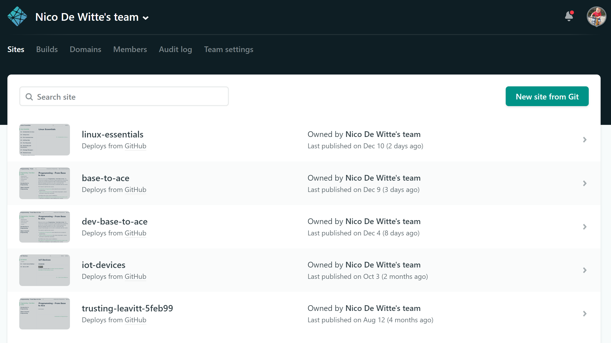
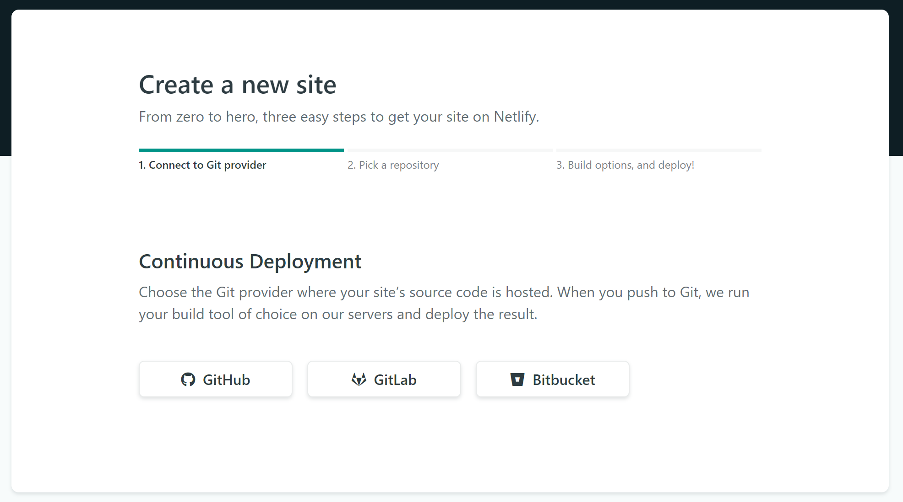
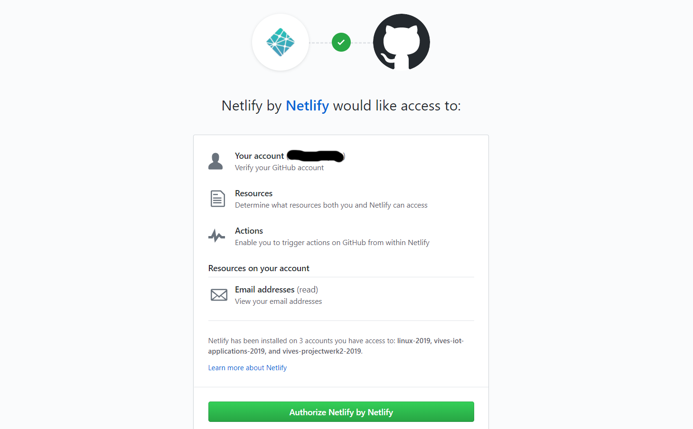
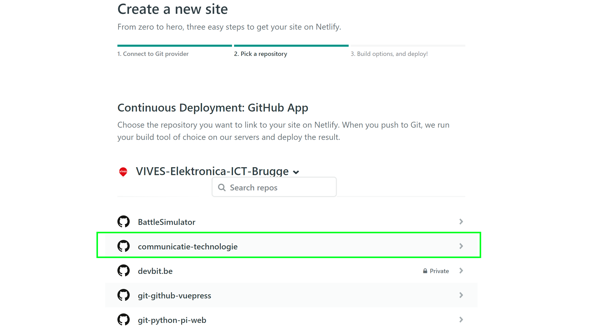
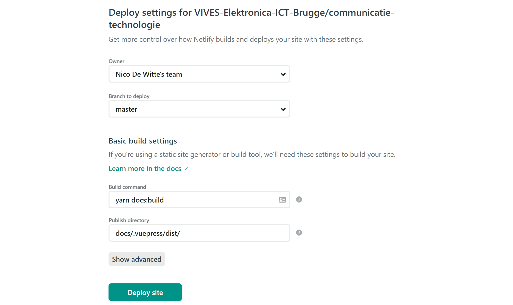
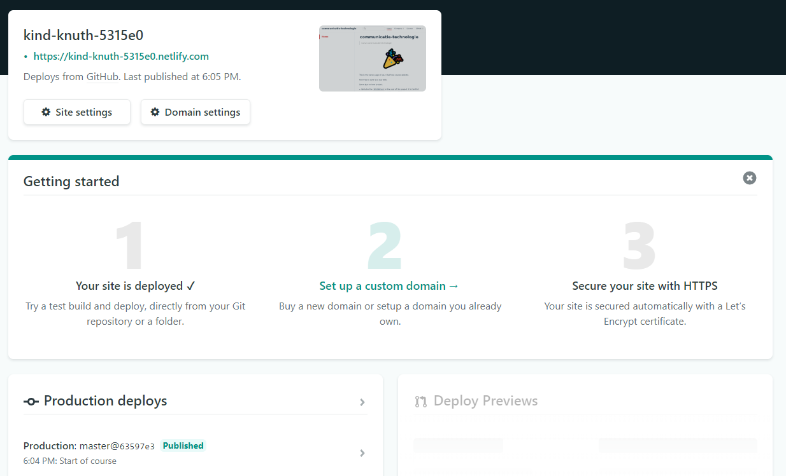
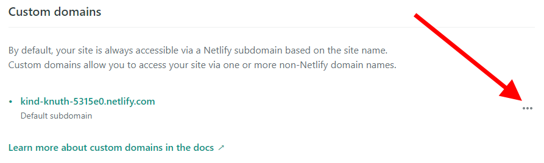
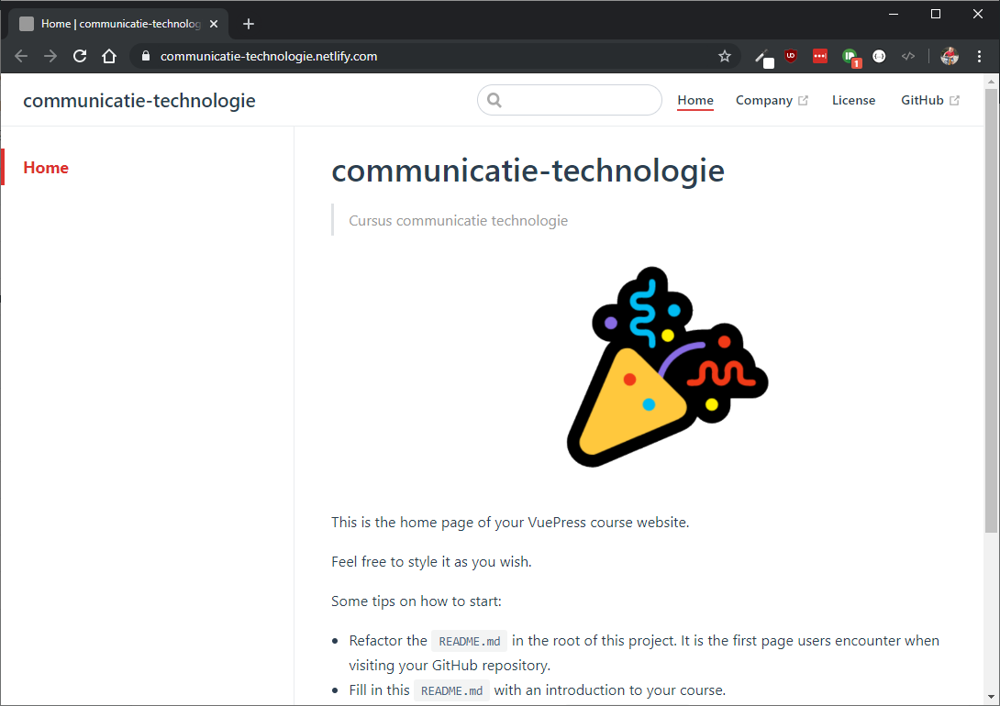

# Netlify

Netlify is a San Francisco-based cloud computing company that offers hosting and serverless backend services for **static websites**.

Netlify is an excellent option for deploying VuePress sites. Netlify is a unified platform that automates your code to create performant, easily maintainable sites and web apps. They provide continuous deployment (Git-triggered builds); an intelligent, global CDN; full DNS (including custom domains); automated HTTPS; asset acceleration; and a lot more.

Their free tier includes unlimited personal and commercial projects, HTTPS, continuous deployment from public or private repositories, and more.

## Creating an Account

First action to perform is to create a Netlify account. Natigate to [netlify.com](https://www.netlify.com/) and click the `Sign up` button.

Luckily this is a quick and painless operation if you choose to login using your GitHub account. You will need to provide access to your GitHub profile.

Once logged in, you should get the dashboard overview of your current projects and their statuses.

## Creating a New Website

Once logged in, hit the `New Site from Git` button. This should bring you to the next page.

Now select to use `GitHub`. Netlify will again request authorization to your GitHub account. This time to access your public and private repositories. Please allow it access.

Next select the correct GitHub repository that contains your VuePress course website. In our case it is `communicatie-technologie`.

The basic configuration should not have to be changed. Your VuePress website has been made Netlify ready by the use of the configuration file `netlify.toml` in the root of your project.

Hit the `Deploy Site` button and wait for the build to finish.

From now on off, every time you push commits to your master branch on GitHub, your site will automatically build and be deployed on Netlify.

At this moment your website can be accessed via a random generated url shown in the top-left of your overview on Netlify. In our example this is [https://kind-knuth-5315e0.netlify.com](https://kind-knuth-5315e0.netlify.com). Click the link on Netlify to view your fancy new course site.

## Changing the Generated URL

Netlify allows you to change the generated URL in a more user-friendly url of your own choosing. Click `Domain settings` and select the three dots next to the domain name `...` and choose `Edit site name`.

Enter a more sensible name for your website.

You should immediately be able to access your site via the new domain name.

