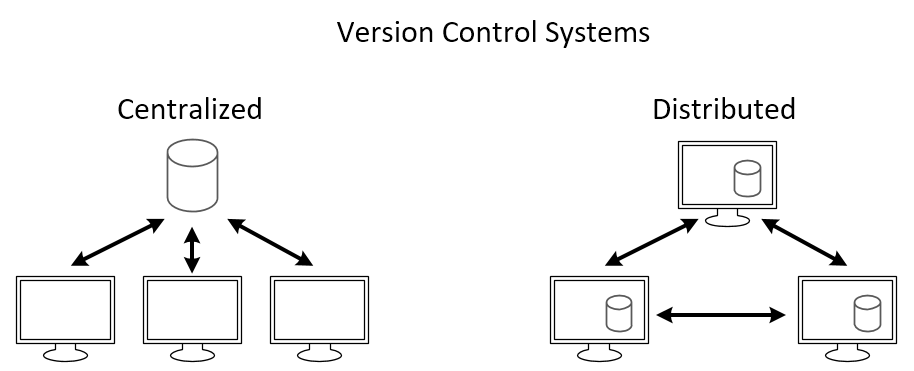

# Version Management

A version control system is an indispensable tool for modern software development. In its essence, version control keeps track of changes of text-based documents such as source code, configuration files and text documents. Different versions, called *commits*, can be viewed, compared, accessed, changed or merged, while keeping track of the whole history of the project.

> Version control manages changes to a set of data over time

Version control systems are used for much more than keeping track of changes. Hooks have been added in version control systems to trigger scripts to test, build and deploy software. For instance, this website is written in a tool which is built on top of a version control system named Git. The [history](https://github.com/vives-devbit/git-course/commits/master) of the document can be viewed at Github. It is automatically deployed with a static website generator to a content delivery network.

Version control systems also facilitate collaboration between multiple persons on a project. Version control systems allow multiple persons to work on the project concurrently and eventually merge their results.

However, even a single person working on a project might benefit from using a version control system. Think of working without a version control system as using an old style typewriter. Typing on a typewriter one could not afford to make mistakes, as correcting a mistake was very difficult. In contrast, in a modern text processor it is very easy to correct a mistake with undo/redo. A version control system is the proverbial undo/redo button on a project level to allow changing a document without fear of making a mistake.

Central to version control systems is a *repository*. The repository is a collection of files which are tracked and it allows to view the history of each of these files, revert to another version or merge changes on a single file. Each version is called a commit, as changes are committed.

There are many version control systems and these tools can be divided in two classes. On the one hand are centralized systems, which rely on a server to keep track of the repository. Subversion and Team Foundation Server are examples. These systems are older, are more difficult to setup and do not scale as well with larger teams. On the other hand are distributed version control systems, e.g. Git and Mercurial. In these systems each contributor keeps track of the full repository locally and (optionally) a server only facilitates sharing the repository. Intuitively this might seem to make collaboration more difficult, in practice distributed workflows allow for a less conflicted merging process. For instance, most large modern software repositories are stored in a distributed version control system, e.g. the [Windows kernel in Git](https://arstechnica.com/information-technology/2017/02/microsoft-hosts-the-windows-source-in-a-monstrous-300gb-git-repository/) or [Facebook in Mercurial](https://code.facebook.com/posts/218678814984400/scaling-mercurial-at-facebook/).



## The four "W" questions of each commit

Version control systems keep track of commits, which answer the four **W** questions. Who? When? Why? and What?

* **Who?** The person who commits the files is identified with the commit.
* **When?** On the one hand, the actual time when the commit has been committed to the repository, is tracked by a timestamp. On the other hand, the prior commit is identified. This way an entire graph of commits can be reconstructed.
* **Why?** Each commit is committed to the repository with a *commit message*. The person committing the commit describes the purpose of the commit. In a meaningful commit message, it is unnecessary to describe what is committed, as it is already been tracked. Rather, the idea of a good commit message is to answer the question why it has been committed.
* **What?** Each commit keeps track of what has been changed. Which files have been added, removed and how the content of these files has changed.

A small example of a commit:

```
Author: Chuck Norris
Date: Thu Feb 28 15:52:55 2019
Message: Chuck Norris only tests in production

Added: prod/test
Removed: staging/test
```
